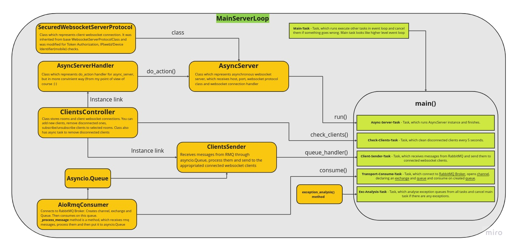

## Asynchronous RMQ -> Websocket Proxy Server

Here is an implementation of typical websocket server which receives messages from RMQ and process them and send to connected websocket clients

In the current state WS server is capable of:
- Running a server instance which accepts websocket connections from clients and control them;
- connecting to RabbitMQ, creating Exchange and Queue and consume on it;
- receiving messages from RMQ Queue;
- processing received RMQ messages and send them to connected websocket clients.

## Struct

## Pip

- pip install aio-rmq-wss-proxy

## Source

- Clone repository
- Run "cd aio_rmq_wss_proxy/"
- Run "make install"
- Run the commands "make run_server" & "make run_client" to see how does it works

Please, note that before running server and client you need to have installed and running Rabbit MQ broker.

This is how it works from the box.

## Customization

You can see the "public_sample" in "_testing/public_sample" directory and use it for build your own proxy server